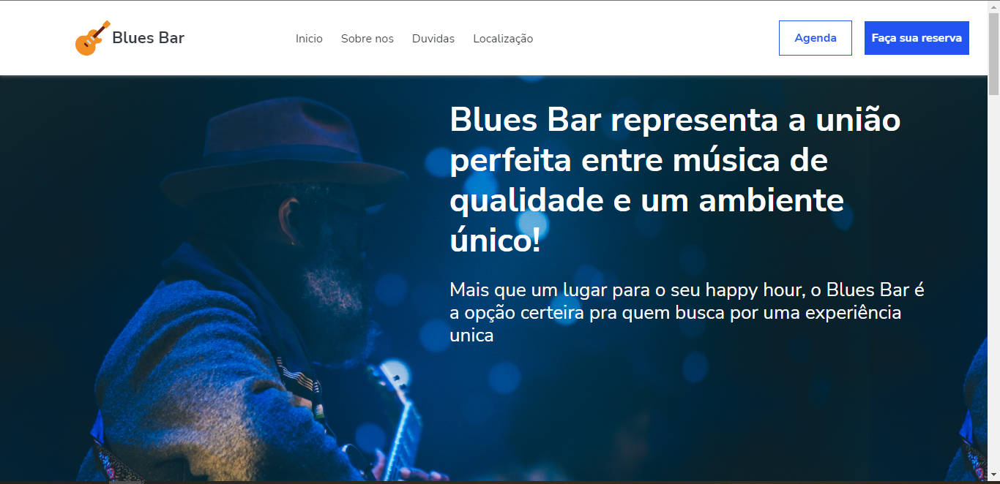

<h1 align="center">
   Blues Bar
</h1>

  <a href="https://willianstephano.github.io/Atv.-Desenvolvimento-Web-I/">
    <b>🚀Acesse o projeto 🚀</b>
  </a>
  

<h4 align="center">
  Atividade realizada para entrega da disciplina de  Desenvolvimento Web I
</h4>

## 📚 Seções
O projeto é composto por uma pagina que contem 4 seções principais:

- **Introdução:** Informações gerais sobre o site e estabelecimento;
- **Card Flutuante:** Principais topicos que circundam a cultura do local;
- **Duvidas frequentes:** FAQ;
- **Localização:** Mapa de onde se encontra o estabelecimento;

---

## 💼 Tecnologias utilizadas
Para o desenvolvimento deste projeto utilizei as seguintes tecnologias:

- HTML;
- CSS;
- JavaScript;
- Todas as imagens foram retiradas do site unsplash.com e nao possuem direitos autorais;
---

#### Autor
Willian Stephano
